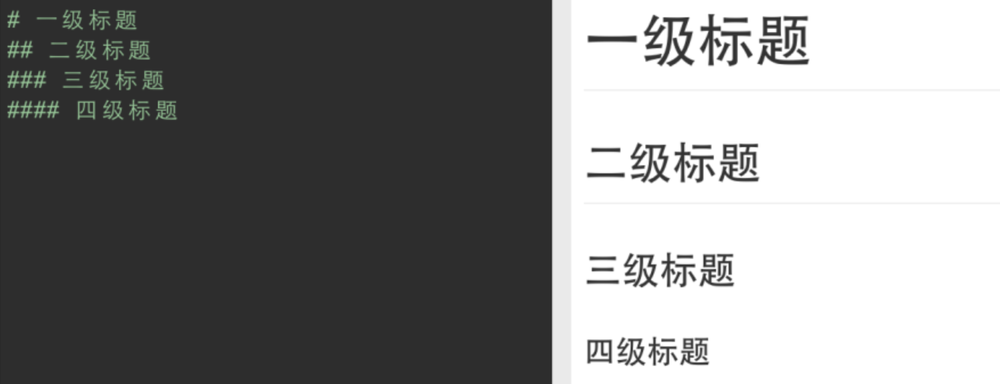

# 1.标题格式  [参考网址](https://www.cnblogs.com/90s-blog/p/15489384.html)

方法一：#     +  空格     + 内容回车，几个#就是几级标题
方法二：ctrl  +  数字键 + 内容回车，数字几就是几级标题


# **2.列表格式**

无序列表:  *     +  空格键  +  内容回车
有序列表: 数字 +  点号     +   空格   +   内容回车



# **3.代码环境设置**

波浪号键(键盘数字1左边)连续按三次+所需环境回车，如```python、java、php...


#  **4.表格插入**

方法一：管道符分割多个文本后回车 #eg：|姓名|性别|年龄|

方法二：ctrl+T直接选择插入几列行列


#  **5.链接设置**

第一种：文本超链接：[文字](网址)
第二种：图片超链接：


# **6.单选框设置**

方式一：选中的：-空格[x]      空格内容回车
方式二：没选中：-空格[空格]空格内容回车


